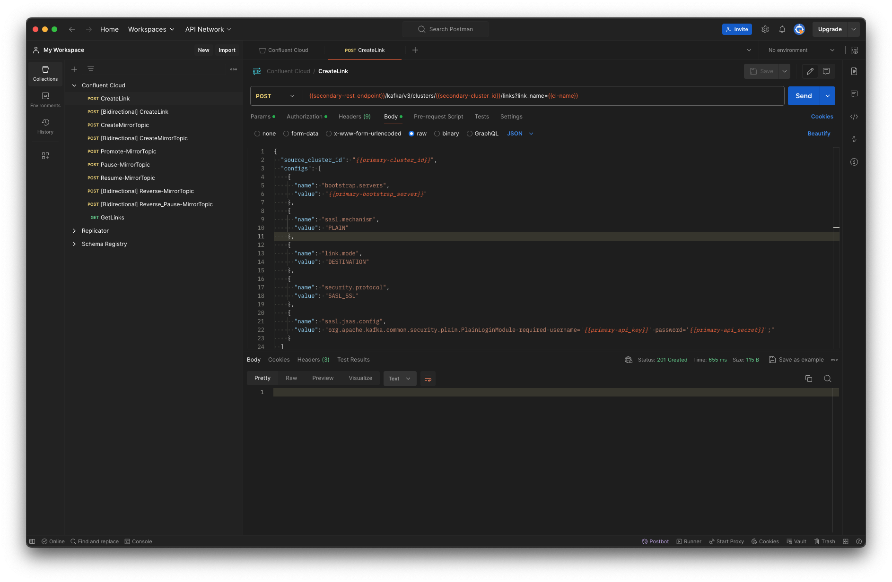
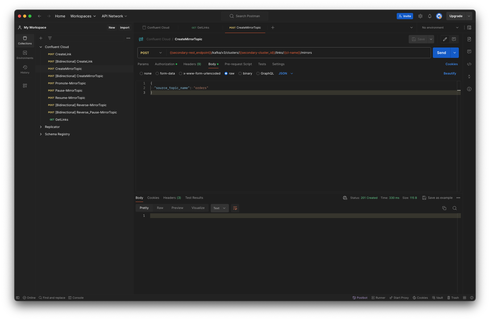
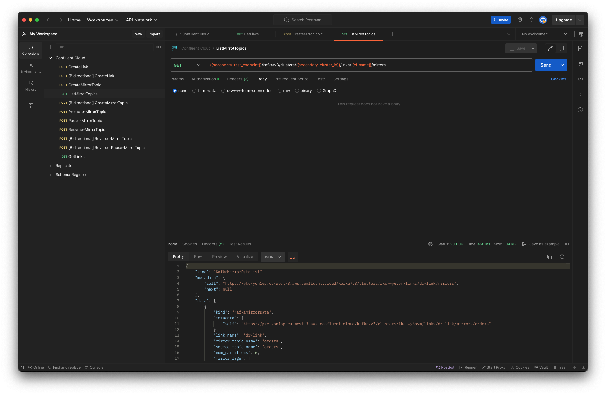
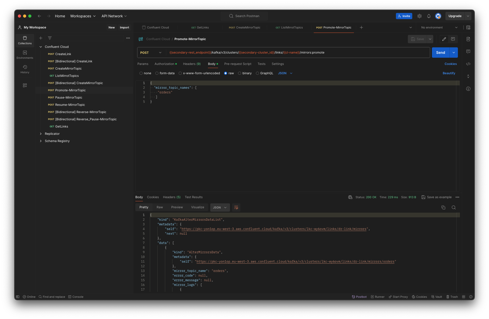

# Confluent Cloud disaster recovery playbook


This playbook contains examples on how to use the Cluster Linking in Confluent Cloud for connecting two Kafka(s) and implement a Disaster Recovery solution.

## Setup

* A primary cluster, on its dedicated environment, deployed in eu-central-1
* A secondary cluster, including a dedicated environment, deployed in eu-west-3.

## Preparation

To make the reproduction of this test bed easier a custom tailored terraform module is included in the [Terraform](terraform) folder.
To run create the clusters, please create a file called *setup.tfvars* that looks like the following

```bash
confluent_cloud_api_key="AAAA"
confluent_cloud_api_secret="BBBB"
cluster_environment="my_dr_primary"
cluster_name="primary_kafka"
secondary_cluster_environment="my_dr_primary"
secondary_cluster_name="primary_kafka"
```

Then use the scripts _apply.sh_ and _plan.sh_ to create the clusters in your Confluent Cloud environment.


Once the clusters are available, you can follow the scripts available in:

* The file [cluster-link-setup.sh](cluster-link-setup.sh) to create the required links and mirror topics using the Confluent Cloud console
* The Postman collection [Confluent Cloud.postman_collection.json](Confluent%20Cloud.postman_collection.json)

*Note*, to be able to configure Cluster Linking, you will need to use the necessaries API_KEY(s) on the Primary and Secondary clusters.

## Flow using Postman to setup Cluster linking

### Create the Link




### Create a Mirror Topic






### Promote a Mirror Topic

